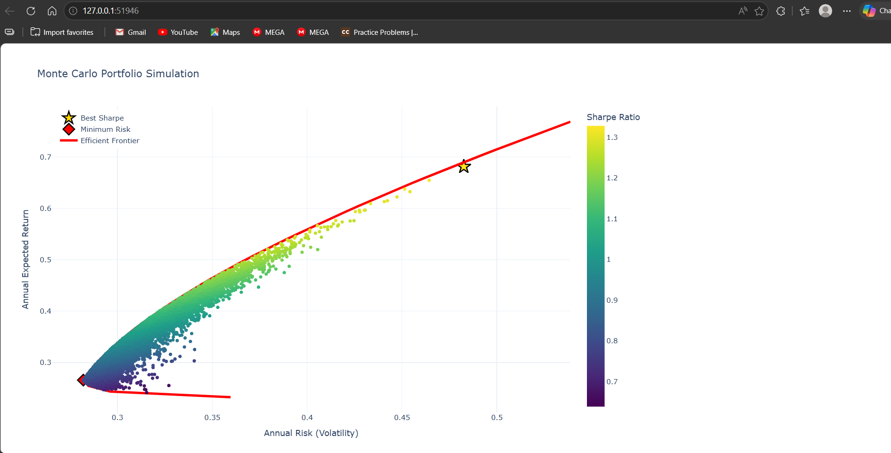

# PyPortfolio

A Python-based portfolio optimization application that analyzes historical stock market data, simulates thousands of portfolio allocations, performs constrained numerical optimization, and visualizes portfolio performance using interactive charts.

---

## Overview

PyPortfolio demonstrates the application of data engineering, numerical optimization, and scientific computing to portfolio analysis.

The project downloads historical market data, computes asset statistics, generates thousands of random portfolios using Monte Carlo simulation, identifies optimal allocations using constrained optimization, and presents the results through interactive visualizations.

The implementation emphasizes modular software design, making each component independently reusable and testable.

---

## Features

- Historical stock price retrieval using Yahoo Finance
- Daily and annual return calculations
- Annualized covariance matrix computation
- Monte Carlo simulation of random portfolios
- Maximum Sharpe Ratio portfolio identification
- Minimum Variance portfolio optimization
- Efficient Frontier generation
- Portfolio allocation pie charts
- Interactive Plotly visualizations
- Modular project architecture

---

## Tech Stack

- Python 3.12
- NumPy
- Pandas
- SciPy
- Plotly
- yfinance
- Matplotlib

---

## Project Structure

```
PyPortfolio/
│
├── images/
│
├── src/
│   ├── market_data.py
│   ├── statistics.py
│   ├── random_portfolio.py
│   ├── optimizer.py
│   ├── monte_carlo.py
│   ├── portfolio_analysis.py
│   ├── efficient_frontier.py
│   ├── frontier.py
│   └── visualization.py
│
├── main.py
├── requirements.txt
├── README.md
└── .gitignore
```

---

## System Workflow

```
Historical Market Data
          │
          ▼
 Data Processing
          │
          ▼
 Statistical Analysis
          │
          ▼
 Monte Carlo Simulation
          │
          ▼
 Numerical Optimization
          │
          ▼
 Portfolio Analysis
          │
          ▼
 Interactive Visualizations
```

---

## Installation

Clone the repository

```bash
git clone https://github.com/prachisoni/PyPortfolio.git
```

Move into the project

```bash
cd PyPortfolio
```

Create a virtual environment

```bash
python -m venv .venv
```

Activate it

### Windows

```bash
.venv\Scripts\activate
```

### Linux / macOS

```bash
source .venv/bin/activate
```

Install dependencies

```bash
pip install -r requirements.txt
```

---

## Usage

Run the application

```bash
python main.py
```

The program will

- Download historical stock prices
- Calculate portfolio statistics
- Generate random portfolios
- Optimize portfolio allocations
- Display interactive visualizations

---

## Visualizations

### Monte Carlo Portfolio Simulation

Displays thousands of simulated portfolios colored by Sharpe Ratio while highlighting:

- Maximum Sharpe Ratio Portfolio
- Minimum Variance Portfolio
- Efficient Frontier



---

### Portfolio Allocation

#### Random Portfolio


#### Maximum Sharpe Portfolio


#### Minimum Variance Portfolio


#### Optimized Portfolio


---

## Engineering Highlights

- Modular architecture with separation of concerns
- Reusable statistical computation modules
- Numerical optimization using SciPy's SLSQP solver
- Monte Carlo simulation for probabilistic analysis
- Interactive visualization using Plotly
- Constraint-based optimization for portfolio allocation
- Vectorized numerical computation with NumPy

---
## Author

**Prachi Soni**

Software Engineer